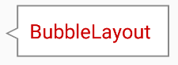
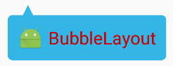
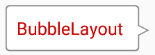

# BubbleLayout
[](http://developer.android.com/index.html)

[](https://android-arsenal.com/api?level=14)

Bubble View for Android. BubbleLayout Extends the FrameLayout.<br>
Easily custom stroke width and color, arrow size, position and direction.

<br>


# Gradle
Add the dependency to your build.gradle.
```
dependencies {
    compile 'com.daasuu:BubbleLayout:1.0.0'
}
```

# Usage


```xml
<com.daasuu.bl.BubbleLayout
    android:layout_width="wrap_content"
    android:layout_height="wrap_content"
    android:padding="8dp"
    app:bl_arrowDirection="left"
    app:bl_arrowHeight="8dp"
    app:bl_arrowPosition="16dp"
    app:bl_arrowWidth="8dp"
    app:bl_strokeWidth="1dp">

    <TextView
        android:layout_width="wrap_content"
        android:layout_height="wrap_content"
        android:layout_gravity="center_vertical"
        android:layout_marginRight="4dp"
        android:text="BubbleLayout"
        android:textColor="@android:color/holo_red_dark" />

</com.daasuu.bl.BubbleLayout>
```
<br>

```xml
<com.daasuu.bl.BubbleLayout
    android:layout_width="wrap_content"
    android:layout_height="wrap_content"
    android:layout_marginTop="12dp"
    android:padding="8dp"
    app:bl_arrowDirection="top"
    app:bl_arrowHeight="8dp"
    app:bl_arrowPosition="12dp"
    app:bl_arrowWidth="8dp"
    app:bl_bubbleColor="@android:color/holo_blue_light"
    app:bl_cornersRadius="8dp">

    <LinearLayout
        android:layout_width="wrap_content"
        android:layout_height="wrap_content"
        android:orientation="horizontal">

        <ImageView
            android:layout_width="20dp"
            android:layout_height="20dp"
            android:src="@mipmap/ic_launcher" />

        <TextView
            android:layout_width="wrap_content"
            android:layout_height="wrap_content"
            android:layout_gravity="center_vertical"
            android:layout_marginLeft="4dp"
            android:text="BubbleLayout"
            android:textColor="@android:color/holo_red_dark" />

    </LinearLayout>

</com.daasuu.bl.BubbleLayout>
```
<br>

```xml
<com.daasuu.bl.BubbleLayout
    android:layout_width="wrap_content"
    android:layout_height="wrap_content"
    android:layout_marginTop="12dp"
    android:padding="8dp"
    app:bl_arrowDirection="right"
    app:bl_arrowHeight="8dp"
    app:bl_arrowPosition="16dp"
    app:bl_arrowWidth="8dp"
    app:bl_cornersRadius="6dp"
    app:bl_strokeWidth="1dp">

    <TextView
        android:layout_width="wrap_content"
        android:layout_height="wrap_content"
        android:layout_gravity="center_vertical"
        android:layout_marginRight="4dp"
        android:text="BubbleLayout"
        android:textColor="@android:color/holo_red_dark" />

</com.daasuu.bl.BubbleLayout>
```

<br>

```JAVA
Button button = (Button) findViewById(R.id.btn_popup);

BubbleLayout bubbleLayout = (BubbleLayout) LayoutInflater.from(this).inflate(R.layout.layout_sample_popup, null);
popupWindow = BubblePopupHelper.create(this, bubbleLayout);

button.setOnClickListener(new View.OnClickListener() {
    @Override
    public void onClick(View v) {
        int[] location = new int[2];
        v.getLocationInWindow(location);
        popupWindow.showAtLocation(v, Gravity.NO_GRAVITY, location[0], v.getHeight() + location[1]);
    }
});
```
layout_sample_popup.xml
```xml
<?xml version="1.0" encoding="utf-8"?>
<com.daasuu.bl.BubbleLayout xmlns:android="http://schemas.android.com/apk/res/android"
    xmlns:app="http://schemas.android.com/apk/res-auto"
    android:layout_width="wrap_content"
    android:layout_height="wrap_content"
    android:padding="@dimen/activity_horizontal_margin"
    app:bl_arrowDirection="top"
    app:bl_arrowHeight="12dp"
    app:bl_arrowPosition="16dp"
    app:bl_arrowWidth="8dp"
    app:bl_bubbleColor="@color/colorAccent"
    app:bl_cornersRadius="2dp">

    <TextView
        android:layout_width="wrap_content"
        android:layout_height="wrap_content"
        android:layout_gravity="center_vertical"
        android:layout_marginRight="4dp"
        android:text="BubbleLayout Popup"
        android:textColor="@android:color/white" />

</com.daasuu.bl.BubbleLayout>
```


# License

Copyright 2016 MasayukiSuda

MIT License

Permission is hereby granted, free of charge, to any person obtaining a copy of this software and associated documentation files (the "Software"), to deal in the Software without restriction, including without limitation the rights to use, copy, modify, merge, publish, distribute, sublicense, and/or sell copies of the Software, and to permit persons to whom the Software is furnished to do so, subject to the following conditions:

The above copyright notice and this permission notice shall be included in all copies or substantial portions of the Software.

THE SOFTWARE IS PROVIDED "AS IS", WITHOUT WARRANTY OF ANY KIND, EXPRESS OR IMPLIED, INCLUDING BUT NOT LIMITED TO THE WARRANTIES OF MERCHANTABILITY, FITNESS FOR A PARTICULAR PURPOSE AND NONINFRINGEMENT. IN NO EVENT SHALL THE AUTHORS OR COPYRIGHT HOLDERS BE LIABLE FOR ANY CLAIM, DAMAGES OR OTHER LIABILITY, WHETHER IN AN ACTION OF CONTRACT, TORT OR OTHERWISE, ARISING FROM, OUT OF OR IN CONNECTION WITH THE SOFTWARE OR THE USE OR OTHER DEALINGS IN THE SOFTWARE.


